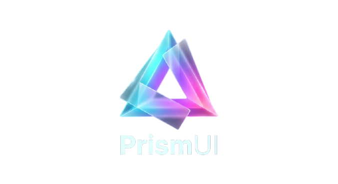

  

# 🧊 PrismUI

  
  
  
  

**PrismUI** is a modern, framework-agnostic UI component library designed to bring the elegance of **Glassmorphism** to enterprise admin panels and data-rich dashboards. 

Built on top of standard **Web Components** using [Lit](https://lit.dev/), styled with [Tailwind CSS](https://tailwindcss.com/), and bundled with [Vite](https://vitejs.dev/), PrismUI integrates seamlessly into any frontend stack—whether you are using React, Vue, Angular, Svelte, or plain Vanilla JavaScript.

## ✨ Key Features

- **🧊 Glassmorphism First:** Beautiful frosted glass effects, vibrant backdrop blurs, and translucent layouts that give depth to your interfaces.
- **🌓 Native Dark Mode:** Flawless transition between bright, airy light themes and deep, glowing dark interfaces, fully integrated with Tailwind's dark mode.
- **🧩 Framework Agnostic:** Write once, run everywhere. True Web Components encapsulated via Shadow DOM.
- **📊 Admin & Dashboard Ready:** A curated set of components tailored for complex layouts, including collapsible sidebars, data tables, stat cards, and interactive forms.
- **⚡ Developer Experience:** Fully typed with TypeScript, blazing fast builds powered by Vite, and automated docs generation.

## 📦 Component Catalog (In Progress)

### Foundations & Actions
- `prism-button`: Multi-variant, loading states, and icon slots.
- `prism-badge`: Status indicators (success, warning, error, info).
- `prism-avatar`: User profile picture with fallback initials.
- `prism-icon`: Lightweight SVG wrapper inheriting `currentColor`.

### Form & Data Entry
- `prism-input`: High-density text inputs with error states and password toggles.
- `prism-textarea`: Auto-resizing multi-line inputs.
- `prism-select`: Custom dropdowns styled seamlessly with Glassmorphism.
- `prism-checkbox`: Indeterminate state support for data tables.
- `prism-radio` / `prism-radio-group`: Accessible radio buttons.
- `prism-toggle`: Smooth animated boolean switches.
- `prism-slider`: Custom styled range sliders.
- `prism-file-upload`: Drag-and-drop zones for file selection.

### Navigation & Routing
- `prism-sidebar`: Collapsible left navigation (expanded vs icon-only mode).
- `prism-navbar`: Sticky top header with slots for search and actions.
- `prism-menu` / `prism-menu-item`: Dropdown menus for profiles or generic actions.
- `prism-tabs`: Horizontal navigation with animated active indicators.
- `prism-breadcrumb`: Hierarchical page location display.
- `prism-pagination`: Controls for data tables.
- `prism-accordion`: Collapsible content sections with grid animations.

### Data Display & Tables
- `prism-table`: Advanced data tables with sorting, pagination, and selection.
- `prism-card`: Flexible Glassmorphism containers.
- `prism-stat`: Dashboard metric cards with trend indicators.
- `prism-progress`: Linear progress bars with glowing gradients.
- `prism-tooltip`: Hover tooltip for extra contextual info.

### Overlays & Feedback
- `prism-modal`: Centered dialog overlays with frosted backdrops.
- `prism-drawer`: Slide-out off-canvas panels for side content.
- `prism-toast`: Floating snackbar notifications (success, error, etc.).
- `prism-alert`: In-page static alert banners.
- `prism-spinner`: Animated glowing loading indicator.

## 🛠️ Tech Stack

- **Core:** Lit & standard Web Components
- **Styling:** Tailwind CSS v3/v4 (Shadow DOM injected)
- **Tooling:** Vite & TypeScript
- **Docs:** VitePress / Storybook
- **CI/CD:** GitHub Actions & GitHub Pages
- **Environment:** Node 26+ Required